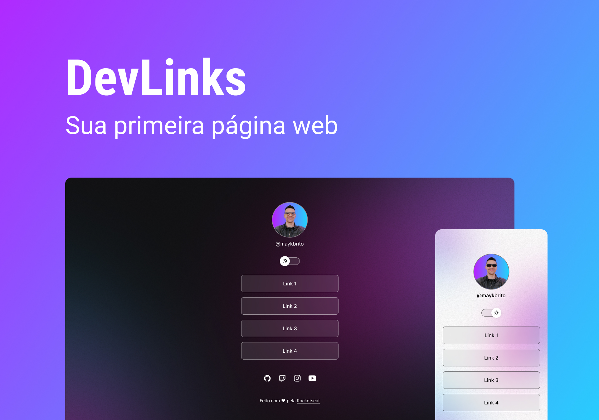

<h1 align="center"> My Links </h1>

Page with my Links with professional informations such as Professional profile, Portfolio and Social media.
  This structure was based on <a href"https://github.com/maykbrito" target""> maykbrito </a> free lesson on Rocketseat plataform. 

  <a href="#-Technologies">Technologies</a>&nbsp;&nbsp;&nbsp;|&nbsp;&nbsp;&nbsp;
  <a href="#-Project">Project</a>&nbsp;&nbsp;&nbsp;|&nbsp;&nbsp;&nbsp;
  <a href="#-Layout">Layout</a>&nbsp;&nbsp;&nbsp;|&nbsp;&nbsp;&nbsp;
  <a href="#memo-licença">Licence</a>

  

## 🚀 Technologies

This project was developed with the follow technologies:

- HTML e CSS
- JavaScript
- Git & Github
- Figma

## 💻 Project

The purpose of this project is to be a link aggregator that works basically as a business card.

## 🔖 Layout

You can visualize the project layout throught [THIS LINK](<https://www.figma.com/file/1adKFAf3N7Dy95WD0RoVGV/DevLinks-(Community)?node-id=10-620&t=RLXRzp0pfcCsmcui-0>). It's necessary to have an account on [Figma](https://figma.com) to acess it.

## :memo: Licence

This project is lincensed under the MIT license.

---

Made with ♥ by Rocketseat :wave: [Join the community](https://discord.gg/rocketseat)
 Feito com ♥ by Rocketseat :wave: [Junte-se a comunidade!](https://discord.gg/rocketseat) 
